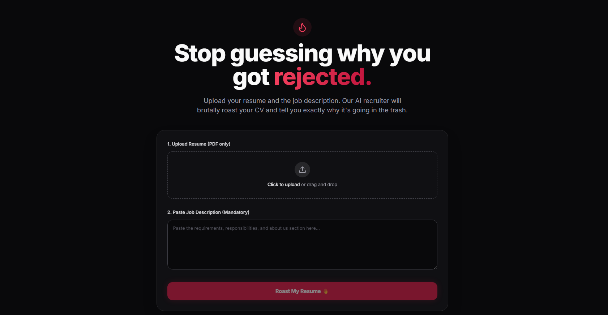

# 🔥 Resume Roaster AI

> Stop guessing why you got rejected. Get utterly roasted instead.

Resume Roaster is a micro-SaaS application that uses multimodal AI to brutally analyze your resume against a specific job description. This isn't your standard, polite career coach. This is the cynical, exhausted tech recruiter who tells you *exactly* why your CV is going straight to the trash—and how to fix it right now.

 *(Preview placeholder)*

## ✨ Features

- **Brutal Honesty**: No sugar-coating. Real feedback based on what recruiters actually think.
- **Job Description Matching**: Paste the JD, upload your PDF, and see exactly where you fall short.
- **Real-Time Streaming**: Watch the roast generate live on your screen via the Vercel AI SDK.
- **Multimodal AI Extraction**: Uses Google Gemini 1.5's native document understanding to read PDFs beautifully without janky text parsers.
- **Aggressive Aesthetics**: Dark mode default. Sleek, fast, and straight to the point.

## 🛠️ Tech Stack

- **Frontend**: Next.js 15 (App Router), React 19
- **Styling**: Tailwind CSS v4, Lucide Icons
- **AI Integration**: Vercel AI SDK (`@ai-sdk/google`, `ai`)
- **LLM**: Google Gemini 1.5 Flash 8B (Fast, multimodal, cost-effective)
- **File Handling**: Native ArrayBuffer to Base64 (No external PDF parsing libraries needed!)

## 🚀 Getting Started

### Prerequisites

You will need Node.js 18+ and a free [Google Gemini API Key](https://aistudio.google.com/app/apikey).

### Installation

1. Clone the repository:
   \`\`\`bash
   git clone https://github.com/yourusername/resume-roaster.git
   cd resume-roaster
   \`\`\`

2. Install dependencies:
   \`\`\`bash
   npm install
   \`\`\`

3. Set up your environment variables:
   Create a \`.env.local\` file in the root directory and add your API key:
   \`\`\`env
   GOOGLE_GENERATIVE_AI_API_KEY=your_gemini_api_key_here
   \`\`\`

4. Start the development server:
   \`\`\`bash
   npm run dev
   \`\`\`

5. Open [http://localhost:3000](http://localhost:3000) in your browser.

## 📂 Project Structure

- \`src/app/page.tsx\`: The main landing page UI.
- \`src/components/RoastForm.tsx\`: The core client-side component handling drag-and-drop, form state, and AI streaming display.
- \`src/app/api/roast/route.ts\`: The serverless API endpoint that processes the PDF buffer and communicates with the Gemini API.

## 💡 How It Works

1. **Upload**: You drop a PDF resume into the UI.
2. **Context**: You paste the Job Description you are applying for.
3. **Processing**: The Next.js API route converts the PDF into a base64 encoded string.
4. **AI Generation**: The payload (JD text + PDF file) is sent to Gemini via the Vercel AI SDK.
5. **Streaming**: The cynical recruiter persona streams back its brutal assessment in three parts: The Brutal Reality, The Fatal Flaws, and The Tough Love.

## 📝 License

This project is open-source and available under the [MIT License](LICENSE).
